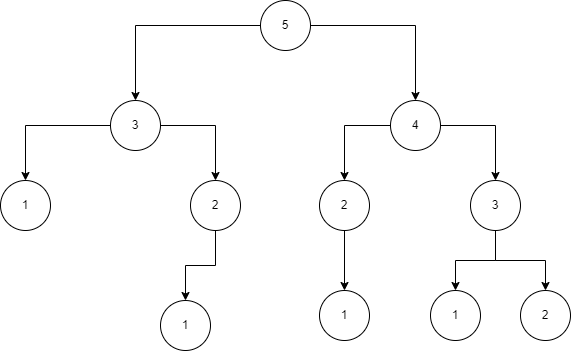
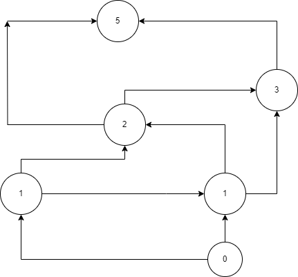

# Exercise 2 
The problem:
F(n) = F(n-3) + F(n -2) where F(0) = 0, F(1) = 1, and F(2) = 2.
Implement the above piecewise recurrence relation in the 3 different ways.
Assume that n will be less than or equal to the maximum integer value and non-negative. You only need to
write the function(s).

**Solution**
The above equation is known as a *recursive definition*. It is similar to a fibonacci sequence only that initial conditions at F(0)=0, F(1)=1 and F(2)=2 while in a fibonacci, the sequence at F(0)=0, F(1)=1 and F(2)=1. The expected results from the sequence are: 0,1,2,1,3,3,4,6,7,10,13 for n=10.

How to run the code:
- Ensure the necessary C compilers are installed in your computer. 
- To check installed compilers run ``` gcc --version``` and ```g++ version``` on Windows, macOS or Linux. 
- If a version number is returned, a compiler has been found.
- If no compiler was found, click the [link](https://www.freecodecamp.org/news/how-to-install-c-and-cpp-compiler-on-windows/) to set up on windows 10 or windows11.

To run the code set up Vs code or run on terminal, follow guide on click [link](https://randerson112358.medium.com/how-to-run-c-program-in-command-prompt-e435186cd162).
  
**Running on visual studio code** 
- To set up visual studio code check the guide by clicking [link](https://code.visualstudio.com/.), remember to select the specific file for your Operationg System.


**1. RECURSION.**
A recursive function is a function that calls itself i.e calling a copy of itself to solve a problem. 


To get the value at a point
- Add the two previous numbers in an array i.e 
- if the length of an array is n,
- the fibonnacci at n is f(n)=f(n-2)+f(n-3).
- check whether the nth number is one or two.
- If the value is 0 return 0, if 1  return 1 and if 2 return 2 else return f(n)=f(n-1)+f(n-2)
 n=3, f(3)=f(3-3)+f(3-2)=f(0)+f(1)=1.
 The time complexity of this function is O(2<sup>n</sup>). 
```
#include<stdio.h>

/*
To get the value at a point
 Add the two previous numbers in an array i.e 
if the length of an array is n,
the fibonnacci at n is f(n)=f(n-2)+f(n-3)
check whether the nth number is one or two.
if the value is 0 return 0, if 1  return 1 and if 2 return 2 else return f(n)=f(n-1)+f(n-2)
*/
unsigned long long fib_recurse(int target);

unsigned long long fib_recurse(int target){
    unsigned long long result;
    if (target == 0){
        result =0;
        return result;
    }
    if (target ==1 ){
        result = 1;
        return result;
    }
    if (target==2){
        result =2;
        return result;

    }
    else{
        result = fib_recurse(target-2)+fib_recurse(target-3) ;
        return result;
       }
}

int main(){
    int target;
    printf("Enter the position you are calculating:");
    scanf("%d", &target);
    unsigned long long fib = fib_recurse(target);
    printf("The result at position %d is: %llu", target, fib);
    return 0;
}
```
Result:
```
The result at position 20 is: 216
```
The recursive approach is used to find out the Fibonacci series. When the value of 'n' increases, the function calls will also increase, and computations will also increase. In this case, the time complexity increases exponentially, and it becomes T(n)=O(2<sup>n</>)
**2. MEMOIZATION.**
This method uses recursion and works top down. It also uses a table to store the results of the subproblems. It solves the results on demand and only stores what is needed. To deteremine the time complexity T(n), find the number of times the function is called multiply by the number of times it takes to execute the calls. The function is called twice.
1.  result = fib_recurse(target-2, memo). (2n) 
2. unsigned long long fib_recurse(int target, unsigned long long memo[]){} which is (1)
The time complexity of the function is a constant 1. T(n)=O(2n+1)+O(1).
Therefore, The time complexity is O(n).

```
   #include<stdio.h>

/*
// /*To get the fibonnacci at a point
// Add the two previous numbers in an array i.e 
// if the length of an array is n,
// the fibonnacci at n is f(n)=f(n-1)+f(n-2)
check whether the nth number is one or two.
if the value is either one or two return 1 else return f(n)=f(n-1)+f(n-2)
*/
unsigned long long fib_recurse(int target, unsigned long long memo[]);

unsigned long long fib_recurse(int target, unsigned long long memo[]){
    unsigned long long result;
    if (memo[target]  != 0){
        return memo[target];
        }
    if (target == 0) {
        result = 0;
        return result;
    }
    if (target ==1) {
        result = 1;
        return result;
    }
    if (target == 2){
        result =2;
        return result;
    }
    else{
        result = fib_recurse(target-2, memo)+fib_recurse(target-3, memo);
        memo[target]=result;
        printf("The index is %d, and the result is%llu \n", target, result);
        return result;
       }
}
```
```
int main(){
    int target;
    printf("Enter the position you are calculating:");
    scanf("%d", &target);
    unsigned long long memo[target+1];
    unsigned long long i;
    for(i=0; i<=target; i++){
        memo[i]=0;
    }
    unsigned long long fib = fib_recurse(target, memo);
    printf("The result at position is :%llu", fib);
    return 0;
}
   ```

**1. Bottom Up/ Dynamic Approach**




```
    #include<stdio.h>
// /*To get the fibonnacci at a point
// Add the two previous numbers in an array i.e 
// if the length of an array is n,
// the fibonnacci at n is f(n)=f(n-1)+f(n-2)
// -create an array of length n,
// -assign first element, index 0 a value of f(0)=0
// -assign second element, index 1 a value of f(1)=1
// to get the third element, the value is f(0)+f(1)=1
// to get nth element, the value is f(n)=f(n-1)+f(n-2)
// */
```
```
unsigned long long fibbo_array(int target);

unsigned long long fibbo_array(int target) {
    int index; // length of the array
    unsigned long long fib[target + 1];
    fib[0] = 0;
    fib[1]=1;
    fib[2] = 2;
    for (index = 3; index <= target; index++) {
        fib[index] = fib[index - 2] + fib[index - 3];
        printf("index is %d, value is %llu\n", index, fib[index]);
    }
    return fib[target];
}
```

```


int main() {
    int target;
    printf("Enter target integer: ");
    scanf("%d", &target);
    unsigned long long fib_na = fibbo_array(target);
    printf("The value at point n is %llu\n", fib_na);

    return 0;
}

```
Result:
```
Enter target integer: 20
index is 3, value is 1
index is 4, value is 3
index is 5, value is 3
index is 6, value is 4
index is 7, value is 6
index is 8, value is 7
index is 9, value is 10
index is 10, value is 13
index is 11, value is 17
index is 12, value is 23
index is 13, value is 30
index is 14, value is 40
index is 15, value is 53
index is 16, value is 70
index is 17, value is 93
index is 18, value is 123
index is 19, value is 163
index is 20, value is 216
The value at point n is 216
```

Explain the differences (advantages, disadvantages) between the 3.

**Advantages of Memoization and Recursion.**
- It is very easy to understand and implement.
- It solves the subproblems only when it is required.
- It is easy to debug.

**Disadvantages of Memoization.**
- It uses the recursion technique that occupies more memory in the call stack. Sometimes when the recursion is too deep, the stack overflow condition will occur.
- It occupies more memory that degrades the overall performance.

**Advantages of Bottom-up(Dynamic programming).**
- Dynamic programming is more efficient for repetitive subproblems, as it avoids redundant computations and saves time. 
- 
**Disadvantages of Bottom-up.**
- It requires more memory and space, as it stores all the results of the subproblems, even if some of them are not needed. 

Summary:

Choosing between dynamic programming(bottom up) and memoization depends on several factors such as: 
- The size and structure of the problem.
- The available memory and time.
- When deciding between speed and space.
In memoization and bottom up approach, the space complexity would be increased as we are storing the intermediate results, but the time complexity would be decreased.
In recursion the time complexity is (2^n), while memoization and bottom up the time complexity is O(n).

**References.**
1. [C/C++ Compliler set up](https://www.freecodecamp.org/news/how-to-install-c-and-cpp-compiler-on-windows/).
2. [Run C VScode](https://www.freecodecamp.org/news/how-to-write-and-run-c-cpp-code-on-visual-studio-code/#:~:text=Simply%20open%20VS%20Code%2FVS,in%20the%20upper%20right%20corner.).
3. [Dynamic Programming](https://www.javatpoint.com/dynamic-programming#:~:text=The%20definition%20of%20dynamic%20programming,solutions%20to%20avoid%20repetitive%20computations.).